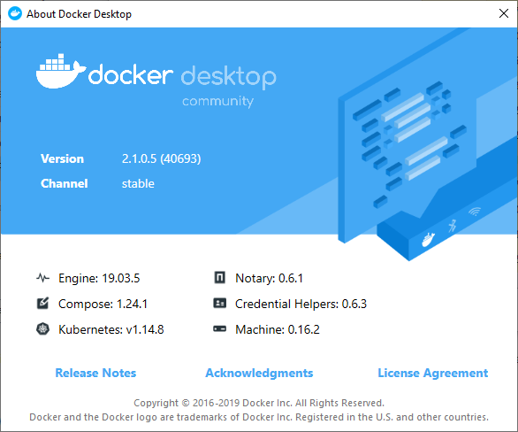
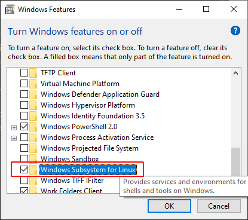
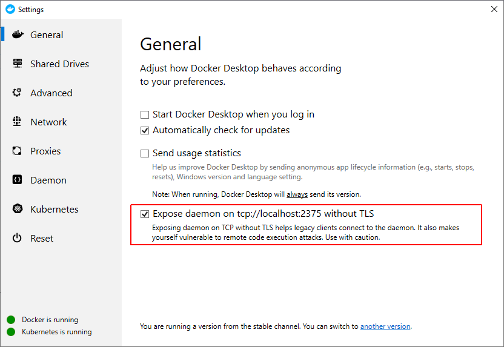
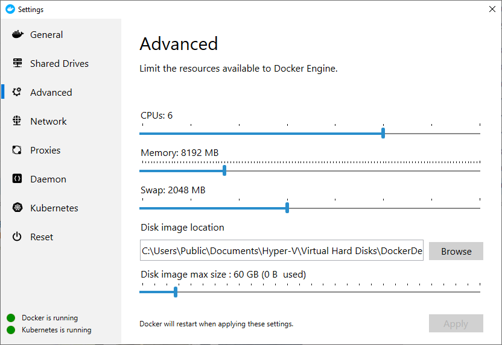
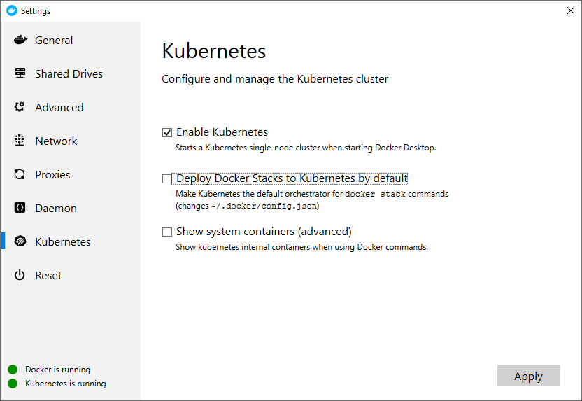
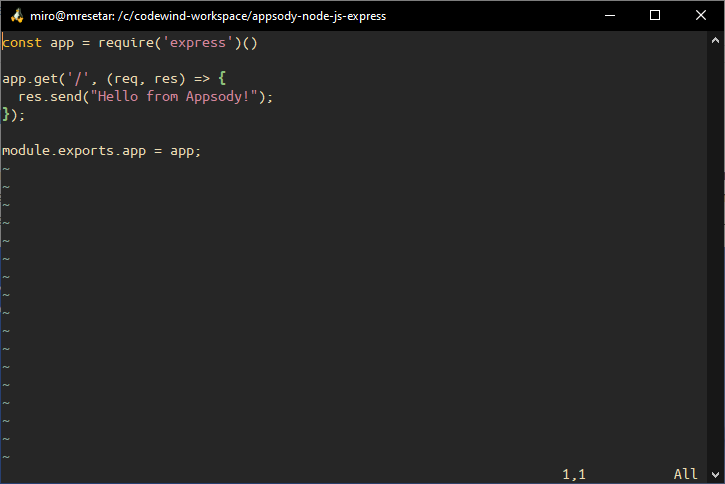

# Establishing Development Environment for Codewind & VS Code on Win10

## About This Guide

This is a short description of what is needed to develop applications locally using VS Code & Codewind. In short the following we need:

 1. Docker
 1. VS Code
 1. Codewind extension
 1. Windows Subsystem for Linux (WSL)
 1. Appsody CLI

Along the way we can make available following tools that might help you progress even further. Those are:

 6. Kubernetes with Docker
 1. Preparing Kubernetes for Appsody
 1. Mintty as a terminal for WSL (WSLtty)

This guide is a followup on the presentation held as part of IBM Virtual Community Day (Cloud Migration) on 14th November 2019.
Presentation is available on [Slideshare](https://www.slideshare.net/mresetar/the-developers-journey-through-ibm-cloud-pak-for-applications).

## 1. Docker

As Appsody and Codewind runs as containers we need an Docker environment.
Install [Docker Desktop](https://docs.docker.com/docker-for-windows/install/). Docker Desktop Windows installer enables Hyper-V if required.
Current version installed:


## 2. VS Code

VS Code is an extensible editor build on open source. Today it is one of the most popular editors which you can customize to extremes.
The best of it, it is free :)
Get it and install it from [here](https://code.visualstudio.com/).

## 3. Codewind Extension

Installing Codewind in VS Code is easy.  Just open Extensions (Ctrl + Shift + X) and search for `Codewind`. Clicking install will enable Codewind extension.
This will also create Codewind workspace directory. Currently, this directory will be created: `c:\codewind-workspace\`. You can't change the path.
In this workspace new projects will be created.

This is enough to start, but for a better experience with containers and `Linux`, it is recommended that `Windows Subsystem for Linux (WSL)` is established.

## 4. Windows Subsystem for Linux (WSL)

Instructions to enable WSL look at [Microsoft site](https://docs.microsoft.com/en-us/windows/wsl/install-win10). You can use PowerShell, or you can use Start Menu and search for `Turn Windows features on and off`. In the dialog, tick the `Windows Subsystem for Linux`.


After enabling WSL and restarting, you should go to `Microsoft Store` and select your favorite Linux distribution. Currently, `Ubuntu` is most popular, but feel free to choose your favorite.

Running `bash` after installing `Linux` subsystem to open a new terminal. This terminal is good, but others exist. One of alternatives is WSLtty.

To work with Docker in the WSL you need to install `docker-ce` client. Then client needs to be connected to the Windows Docker Desktop environment.

You can install `docker-ce` by running [docker-client.sh](docker-client.sh) script.

### 4.1 Connecting to Docker Desktop

After installing `docker-ce` you need to connect it to Windows server. One liner:

```bash
echo "export DOCKER_HOST=tcp://localhost:2375" >> ~/.bashrc && source ~/.bashrc
```

Running `docker version` should now produce the server and client information.

If for some reason you get: `Cannot connect to the Docker daemon at tcp://localhost:2375. Is the docker daemon running?` message, you need to enable exposing Docker on TCP without TLS in General settings of the Docker Desktop app.



### 4.2 Mounting C Drive in Root Folder

By default C drive is mounted as `/mnt/c`. This does not work well with Windows Docker engine. When working with volumes, Docker for Windows will mount folder in format `/c/Directory/Directory/`.
To have better support for volumes in WLS we can change the default mount point to be `/c/`.

To change to this add the following in the `/etc/wsl.conf` file.

```text
# Enable extra metadata options by default
[automount]
enabled = true
root = /
options = "metadata,umask=22,fmask=11"
mountFsTab = false

# Enable DNS – even though these are turned on by default, we’ll specify here just to be explicit.
[network]
generateHosts = true
generateResolvConf = true
```

Restart the `LxssManager` service after this.

After service restart, `ls /c/Users` should list contents of the Users folder.

## 5. Installing Appsody CLI in WSL

Appsody CLI enables one to work with application stacks (templates). It is available as a Windows binary, but it is better experience working in WSL overall.
To simplify the procedure of installation (which is not complex) you can use provided [appsody.sh](appsody.sh) script. You can specify the version to install by setting the environment variable; `export APPSODY_VERSION=X.Y.Z`. You need to have `sudo` permissions.
Sample output of the script:

```text
  % Total    % Received % Xferd  Average Speed   Time    Time     Time  Current
                                 Dload  Upload   Total   Spent    Left  Speed
100   623    0   623    0     0   1075      0 --:--:-- --:--:-- --:--:--  1077
100 11.1M  100 11.1M    0     0   903k      0  0:00:12  0:00:12 --:--:--  902k
[sudo] password for xxxx:
Installed: appsody 0.5.0
```

Running `appsody` produces help output.

### 5.1 Adding Kabenero Stacks Repository

Together with Appsody stacks, you can add a Kabanero Collections. Kabanero Enterprise with comes with supported runtimes and is fully backed by [IBM Cloud Pak for Applications.](https://www.ibm.com/cloud/cloud-pak-for-applications).

Adding Kabanero collections as a repository is simple enough. One line. To make it easier and to set Kabanero collection repo as default run the script [kabanero-repo.sh](kabanero-repo.sh).
You can specify the version to set by setting the environment variable; `export KABANERO_VERSION=X.Y.Z`.

The output of the `appsody list kabanero` command should show the latest stacks available:

```text
REPO            ID                      VERSION         TEMPLATES               DESCRIPTION
kabanero        java-microprofile       0.2.18          *default                Eclipse MicroProfile on Open Liberty & OpenJ9 using Maven
kabanero        java-spring-boot2       0.3.15          *default, kotlin        Spring Boot using OpenJ9 and Maven
kabanero        nodejs                  0.2.5           *simple                 Runtime for Node.js applications
kabanero        nodejs-express          0.2.7           scaffold, *simple       Express web framework for Node.js
kabanero        nodejs-loopback         0.1.5           *scaffold               LoopBack 4 API Framework for Node.js
```

## 6. Kubernetes with Docker

To test local deploys of Appsody applications, we should enable Kubernetes support. Make sure that you configure enough resources to run all the necessary components in K8S.

It is recommended to have 6 CPU, 8GB of RAM and 2GB of Swap. Increase disk space as needed.



To enable Kubernetes support by Docker for Windows it is just one checkbox in the Settings of the Docker Desktop.



If you open Windows Command and run `kubectl version`. Output should show current installed client and server version.

```text
Client Version: version.Info{Major:"1", Minor:"14", GitVersion:"v1.14.8", GitCommit:"211047e9a1922595eaa3a1127ed365e9299a6c23", GitTreeState:"clean", BuildDate:"2019-10-15T12:11:03Z", GoVersion:"go1.12.10", Compiler:"gc", Platform:"windows/amd64"}
Server Version: version.Info{Major:"1", Minor:"14", GitVersion:"v1.14.8", GitCommit:"211047e9a1922595eaa3a1127ed365e9299a6c23", GitTreeState:"clean", BuildDate:"2019-10-15T12:02:12Z", GoVersion:"go1.12.10", Compiler:"gc", Platform:"linux/amd64"}
```

### 6.1 Enabling kubectl in WSL

To enable `kubectl` usage from the WSL use. Run the `kubectl.sh` script to install `kubectl` tool. Next is to copy config from the Win file system to the WSL home dir.

```bash
mkdir ~/.kube && cp /c/Users/<USERNAME>/.kube/config ~/.kube
kubectl config use-context docker-for-desktop
kubectl cluster-info
```

The last command should show something like:

```text
Kubernetes master is running at https://kubernetes.docker.internal:6443
KubeDNS is running at https://kubernetes.docker.internal:6443/api/v1/namespaces/kube-system/services/kube-dns:dns/proxy

To further debug and diagnose cluster problems, use 'kubectl cluster-info dump'.
```

### 7. Preparing Kubernetes for Appsody

To be able to deploy local Appsody applications to the Kubernetes environment, there are some required configuration changes on the k8s env. In particular, KNative and Istion should be installed.
Good documentation of the needed steps are available at [Appsody page](https://appsody.dev/docs/using-appsody/installing-knative-locally/).

To verify that everything is working, create a new project and deploy it to the new environment.

Steps I've taken:

```bash
kubectl create namespace appsody
kubectl config set-context --current --namespace=appsody
appsody deploy --knative --namespace appsody
```

If after those steps you get `ImagePullBackOff` by running `kubectl get all`

```text
NAME                                                            READY   STATUS             RESTARTS   AGE
pod/appsody-node-js-express-ccv9k-deployment-8498c5f577-2nxvc   1/3     ImagePullBackOff   0          15s
pod/appsody-operator-5b5fdf86d6-xwdr8                           1/1     Running            0          18s
```

It might be that your image (as in my case) wasn't tagged correctly. My understanding is that `appsody deploy` should perform that but It doesn't happen.

So take a look into Docker images and if there is no `dev.local/appsody-node-js-express` image tag the latest one with:

```bash
docker tag appsody-node-js-express:latest dev.local/appsody-node-js-express
```

After this, there should be an application responding at the similar endpoint to
`http://appsody-node-js-express.appsody.192.168.9.176.nip.io` with `Hello from Appsody!`.

## 8. Mintty as a terminal for WSL (WSLtty)

With WSL you get a `bash` terminal. It is OK, but it can be a little bit better. For instance, there is no theming support, and copy and pasting could be better. Luckily, there are alternatives.
One good alternative is WSLtty. It is a mintty terminal that is well known, for instance, as a Git Bash but for the WSL environment.

First thing after the setup is customizing the theme. There are a number of themes available, one is `gruvbox`.
Theme comes from one text files which defines colors. You can find it [here](https://github.com/morhetz/gruvbox-contrib/tree/master/mintty). Slightly modified version of the same can be found in [wsltty/gruvbox](wsltty/gruvbox). Place the file in the `C:\Users\<USERNAME>\AppData\Roaming\wsltty\themes` folder. For the more complete Linux experience, you can download Ubuntu font from [here](https://design.ubuntu.com/font/). Scroll down to find download section.
With everything setup you should have a pretty good experience in vi editor to.



### 8.1 Install theme in VS Code

To match the same color scheme in the VS Code editor there is also a
`Gruvbox Theme` extension for the VS Code.
You can find it in Extension or as shortcut hit `Ctrl + P` and enter `ext install jdinhlife.gruvbox`. This will install the Theme. As a config you can select the best variant for you.


Notes:
Instructions above are for WSL 1. WSL 2 will be generally available next year. It will bring performance improvements and even better experience of Linux on Windows.
For WSL 2 there will is a new type of Docker support. There is a good [blog post](https://www.docker.com/blog/developing-docker-windows-app-wsl2/) explaining how this all works.

